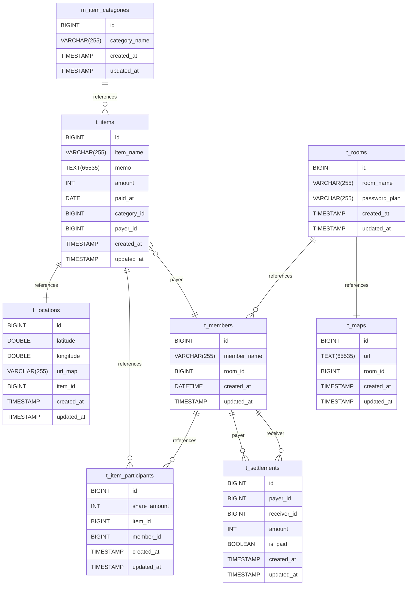

```mermaid
erDiagram
	t_items ||--|| t_locations : references
	t_rooms ||--o{ t_members : references
	t_members ||--o{ t_item_participants : references
	t_items ||--o{ t_item_participants : references
	t_members ||--o{ t_settlements : payer
	t_members ||--o{ t_settlements : receiver
	m_item_categories ||--o{ t_items : references
	t_rooms ||--|| t_maps : references
	t_items }o--|| t_members : payer

	m_item_categories {
		BIGINT id
		VARCHAR(255) category_name
		TIMESTAMP created_at
		TIMESTAMP updated_at
	}

	t_rooms {
		BIGINT id
		VARCHAR(255) room_name
		VARCHAR(255) password_plan
		TIMESTAMP created_at
		TIMESTAMP updated_at
	}

	t_items {
		BIGINT id
		VARCHAR(255) item_name
		TEXT(65535) memo
		INT amount
		DATE paid_at
		BIGINT category_id
		BIGINT payer_id
		TIMESTAMP created_at
		TIMESTAMP updated_at
	}

	t_members {
		BIGINT id
		VARCHAR(255) member_name
		BIGINT room_id
		DATETIME created_at
		TIMESTAMP updated_at
	}

	t_locations {
		BIGINT id
		DOUBLE latitude
		DOUBLE longitude
		VARCHAR(255) url_map
		BIGINT item_id
		TIMESTAMP created_at
		TIMESTAMP updated_at
	}

	t_item_participants {
		BIGINT id
		INT share_amount
		BIGINT item_id
		BIGINT member_id
		TIMESTAMP created_at
		TIMESTAMP updated_at
	}

	t_settlements {
		BIGINT id
		BIGINT payer_id
		BIGINT receiver_id
		INT amount
		BOOLEAN is_paid
		TIMESTAMP created_at
		TIMESTAMP updated_at
	}

	t_maps {
		BIGINT id
		TEXT(65535) url
		BIGINT room_id
		TIMESTAMP created_at
		TIMESTAMP updated_at
	}
```