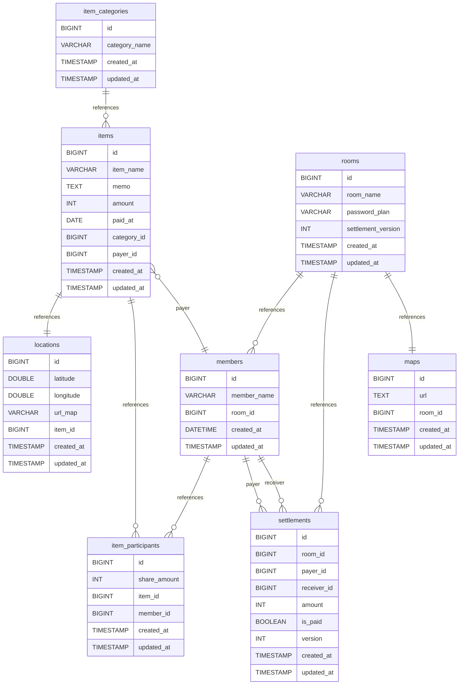

編集用の Mermaid ソースです。GitHub 上では下のコードブロックが図として表示されます。`doc/image/er.svg` の再生成手順は [README の ER 図の節](../README.md#er-図) を参照してください。

```mermaid
erDiagram
  items ||--|| locations : references
  rooms ||--o{ members : references
  members ||--o{ item_participants : references
  items ||--o{ item_participants : references
  rooms ||--o{ settlements : references
  members ||--o{ settlements : payer
  members ||--o{ settlements : receiver
  item_categories ||--o{ items : references
  rooms ||--|| maps : references
  items }o--|| members : payer

  item_categories {
    BIGINT id
    VARCHAR category_name
    TIMESTAMP created_at
    TIMESTAMP updated_at
  }

  rooms {
    BIGINT id
    VARCHAR room_name
    VARCHAR password_plan
    INT settlement_version
    TIMESTAMP created_at
    TIMESTAMP updated_at
  }

  items {
    BIGINT id
    VARCHAR item_name
    TEXT memo
    INT amount
    DATE paid_at
    BIGINT category_id
    BIGINT payer_id
    TIMESTAMP created_at
    TIMESTAMP updated_at
  }

  members {
    BIGINT id
    VARCHAR member_name
    BIGINT room_id
    DATETIME created_at
    TIMESTAMP updated_at
  }

  locations {
    BIGINT id
    DOUBLE latitude
    DOUBLE longitude
    VARCHAR url_map
    BIGINT item_id
    TIMESTAMP created_at
    TIMESTAMP updated_at
  }

  item_participants {
    BIGINT id
    INT share_amount
    BIGINT item_id
    BIGINT member_id
    TIMESTAMP created_at
    TIMESTAMP updated_at
  }

  settlements {
    BIGINT id
    BIGINT room_id
    BIGINT payer_id
    BIGINT receiver_id
    INT amount
    BOOLEAN is_paid
    INT version
    TIMESTAMP created_at
    TIMESTAMP updated_at
  }

  maps {
    BIGINT id
    TEXT url
    BIGINT room_id
    TIMESTAMP created_at
    TIMESTAMP updated_at
  }
```
